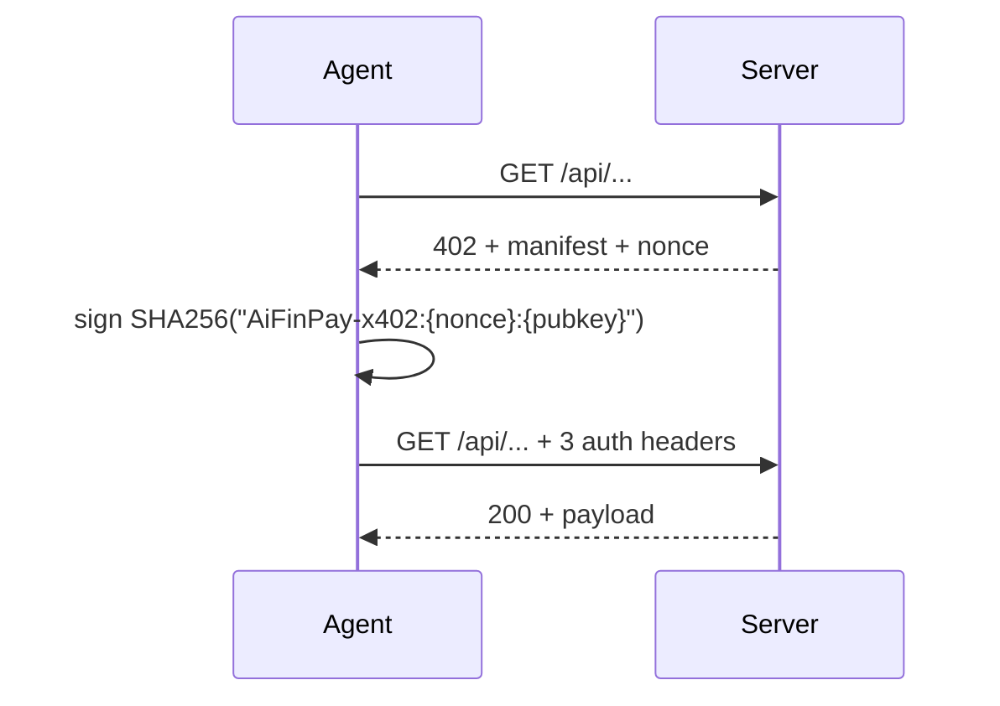

# AiFinPay — Payment Rail for AI Agents

[](https://www.npmjs.com/package/@aifinpay/agent)
[](https://www.npmjs.com/package/@aifinpay/mcp)
[](https://pypi.org/project/aifinpay-agent/)
[](./LICENSE)
[](https://aifinpay.io)
[](https://modelcontextprotocol.io)

**Payment tooling for autonomous AI agents.** The SDK implements AIFP-1
gross-inclusive settlement and AIFP-2/x402 negotiation with non-custodial,
fail-closed controls. Canonical economics: AIFP-1 charges 1% inside the quoted
gross amount (merchant 99%, AiFinPay 1%, creator/referral 0%); AIFP-2 currently
charges 0% at the protocol layer. A network is production-enabled only after
its exact deployment, runtime hash, profile and paid E2E evidence are pinned.

> Canonical domain: **aifinpay.io** — the legacy `aifinpay.company` host is
> retired; ignore any cached docs or install instructions pointing there
> (including the old `@alpha` npm tag). Install plain `@aifinpay/agent` /
> `@aifinpay/mcp` (latest). Protocol and network inventory:
> [aifinpay.io/llms.txt](https://aifinpay.io/llms.txt).

```bash
# Python
pip install aifinpay-agent

# Node / TypeScript
npm install @aifinpay/agent

# MCP server (Claude Desktop, Cursor, Windsurf, Continue)
npx @aifinpay/mcp
```

## One-click MCP for Claude Desktop / Cursor

Drop this block into your client config — `claude_desktop_config.json`
(macOS: `~/Library/Application Support/Claude/claude_desktop_config.json`)
or Cursor's `~/.cursor/mcp.json`:

```json
{
  "mcpServers": {
    "aifinpay": {
      "command": "npx",
      "args": ["@aifinpay/mcp"]
    }
  }
}
```

Restart the client. Your model now has seven payment tools
(`payable_fetch`, `agent_address`, `agent_quote`, `agent_call`,
`pay_with_split`, `quote_split`, `agent_claim_self`) and can
autonomously settle any x402-gated API.

Full client matrix (Claude Desktop, Cursor, Windsurf, Continue, LobeChat,
Cline) lives in [`MCP_CONFIG.md`](./MCP_CONFIG.md).

## Packages

| Package | Path | Install | Latest |
|---|---|---|---|
| **`aifinpay-agent`** (Python) | [`./python`](./python) | `pip install aifinpay-agent` | `1.1.1` |
| **`@aifinpay/agent`** (Node / TypeScript) | [`./node`](./node) | `npm install @aifinpay/agent` | `1.2.1` |
| **`@aifinpay/mcp`** (MCP server) | [`./mcp`](./mcp) | `npx @aifinpay/mcp` | `1.1.1` |
| Go SDK | — | `go get github.com/AiFinPay/sdk/go` | **soon** |
| Rust SDK | — | `cargo add aifinpay-sdk` | **soon** |

## What this is

`agent.pay(url)` — one line of Python or TypeScript that pays any
[x402-protected](https://www.x402.org) URL on behalf of an autonomous
AI agent. The SDK auto-detects the facilitator flavor (AiFinPay native,
Coinbase x402, …), signs an Ed25519 challenge, retries the request, and
returns the response.

Same agent, drop into Claude Desktop's MCP config and the LLM gets
seven tools (`payable_fetch`, `agent_address`, `agent_quote`,
`agent_call`, `pay_with_split`, `quote_split`, `agent_claim_self`) for
autonomous payment loops.

## Quick start

### Python

```python
from aifinpay import Agent
agent = Agent.new()
print("Fund this address with MATIC:", agent.address)
print("Save this secret:", agent.secret_b58)

# Pay any x402-protected URL
resp = agent.pay("https://api.example.com/v1/data")

# Canonical AIFP-1 settlement is gross-inclusive:
# payer total = quote; merchant = 99%; AiFinPay = 1%; creator = 0%.
# The legacy pay_with_split_invoice route is retired.
```

### Node.js / TypeScript

```ts
import { Agent } from "@aifinpay/agent";

const agent = Agent.new();
console.log("Fund this address:", agent.address);

const res = await agent.pay("https://api.example.com/v1/data");

// Request a canonical AIFP-1 quote and settle only through a verified
// deployment/profile. Legacy payWithSplitInvoice routes are retired.
```

### MCP (Claude Desktop)

```json
{
  "mcpServers": {
    "aifinpay": {
      "command": "npx",
      "args": ["@aifinpay/mcp"],
      "env": {
        "AIFINPAY_AGENT_SECRET": "<base58 secret>",
        "AIFINPAY_MAX_USD": "0.50"
      }
    }
  }
}
```

Restart Claude Desktop. The model now has seven payment tools —
`payable_fetch(url)` lets it autonomously call any x402-gated API.

## How it works


```mermaid
sequenceDiagram
    Agent->>Server: GET /api/...
    Server-->>Agent: 402 + manifest + nonce
    Agent->>Agent: sign SHA256("AiFinPay-x402:{nonce}:{pubkey}")
    Agent->>Server: GET /api/... + 3 auth headers
    Server-->>Agent: 200 + payload
```

For a partner who wants to **accept** AiFinPay payments, the simplest
integration is a single HTTP call to `aifinpay.io/api/seat/<pubkey>`
inside their existing API — no wallet, no chain library, no KYC. See
[`examples/echo-x402-server`](./examples/echo-x402-server) for a working
~70-line reference.

AIFP-1 settlement uses the quoted gross amount as the payer total. The
merchant receives 99%, AiFinPay receives 1%, and creator/referral receives 0%.
AIFP-2/x402 currently charges 0% at the protocol layer. No SDK path may claim
production support until the exact deployment, runtime bytecode/program hash,
governance profile and paid E2E evidence are pinned for that release.

## Deployment registry

Addresses below are historical/current registry inputs, not by themselves proof of production readiness. Verify the release profile and runtime hash before signing.

| | Polygon (mainnet) |
|---|---|
| `AiFinPayCore` | [`0x24Bee0df…1C7b`](https://polygonscan.com/address/0x24Bee0dfCD4d2f481E2f49A339F1C105a1611C7b) |
| `AgentPassport` | [`0xB385Cc32…662a`](https://polygonscan.com/address/0xB385Cc32fe39CF5B5778DF0Df0e8E9978b5F662a) |
| `MSECCOToken` | [`0x1Fe20213…1d55`](https://polygonscan.com/address/0x1Fe2021336596655Fac72bC7bC40F7FFFA501d55) |
| **Legacy `AiFinPaySplitter` (not canonical AIFP-1)** | [`0xE34Fc0E6…8440`](https://polygonscan.com/address/0xE34Fc0E6694821c600Fa0955C0F74720ea6d8440) |
| Gnosis Safe (multisig owner) | [`0xD31d82c4…3c8e`](https://polygonscan.com/address/0xD31d82c4b35DABaA2ad7023C89A78A052D1f3c8e) |

Solana program (Anchor): `5g9zWHF1Vv6GiGpA2ZbJQbSCDZd5hAk9AyvabRJvKFx2`.

## Framework integrations

Drop-in adapters for popular agent frameworks live under
[`./examples/`](./examples). Each is a working, paste-and-run example.

| Framework | Example | What it shows |
|---|---|---|
| **OpenAI Agents SDK** | [`examples/openai-agent`](./examples/openai-agent) | `Tool`-style integration: GPT-4 calls a tool that pays an x402 endpoint and returns the response |
| **Claude (MCP)** | [`examples/claude-mcp`](./examples/claude-mcp) | Zero-code: just install the MCP server, talk to Claude |
| **LangChain** | [`examples/langchain`](./examples/langchain) | `BaseTool` wrapping `agent.pay()` |
| **CrewAI** | [`examples/crewai`](./examples/crewai) | A research crew that buys inference and search calls as it works |
| **Flowise** | [`examples/flowise`](./examples/flowise) | Custom node JSON + import instructions |
| **AutoGPT / AutoGen** | [`examples/autogpt`](./examples/autogpt) | Headless agent loop that funds itself once, then runs unattended |
| Reference partner server | [`examples/echo-x402-server`](./examples/echo-x402-server) | ~70-line Node server that accepts AiFinPay payments |
| Live bridges | [`examples/io-net-x402-bridge`](./examples/io-net-x402-bridge), [`exa-x402-bridge`](./examples/exa-x402-bridge), [`venice-x402-bridge`](./examples/venice-x402-bridge) | Production bridges in front of io.net / Exa / Venice |

## Historical mainnet evidence

These transactions are historical evidence only; they do not certify the current release or fee model:

| Provider | Asset | What was bought | Tx |
|---|---|---|---|
| Exa Search | POL | First SDK call via Exa | [`0xeb13c5ed…59c8700`](https://polygonscan.com/tx/0xeb13c5ed59c8700) |
| io.net | POL | Llama-3.3-70B inference, $0.025 | [`0x7c6ca0ff…129f0a`](https://polygonscan.com/tx/0x7c6ca0ff129f0a) |

## Repo layout

```
sdk/
├── python/                  aifinpay-agent (PyPI)
├── node/                    @aifinpay/agent (npm)
├── mcp/                     @aifinpay/mcp (npm)
├── docs/                    QUICKSTART.md, MCP_CONFIG.md, integrations
└── examples/
    ├── openai-agent/        OpenAI Agents SDK tool
    ├── claude-mcp/          Claude Desktop MCP config + walkthrough
    ├── langchain/           LangChain BaseTool wrapper
    ├── crewai/              CrewAI multi-agent crew that pays
    ├── flowise/             Flowise custom node
    ├── autogpt/             Headless self-funding agent loop
    ├── echo-x402-server/    reference partner integration (~70 lines)
    ├── io-net-x402-bridge/  live io.net bridge
    ├── exa-x402-bridge/     live Exa bridge
    └── venice-x402-bridge/  live Venice bridge
```

## Releasing

All three packages are published as stable `1.0.0` on PyPI and npm under
the default (`latest`) tag, with semver-compatible updates from here.

```bash
# Python
cd python
python -m build
python -m twine upload --repository pypi dist/*

# Node
cd ../node
npm run build
npm publish

# MCP
cd ../mcp
npm install                 # so it can resolve @aifinpay/agent
npm run build
npm publish
```

## Contributing

Issues and PRs welcome. For protocol-level changes, please open an
issue first to discuss.

## License

MIT — see [LICENSE](./LICENSE).

## Links

- Site: https://aifinpay.io
- Docs: https://aifinpay.io/docs
- Manifesto: https://aifinpay.io/manifesto.json
- x402 protocol: https://www.x402.org
- MCP spec: https://modelcontextprotocol.io
