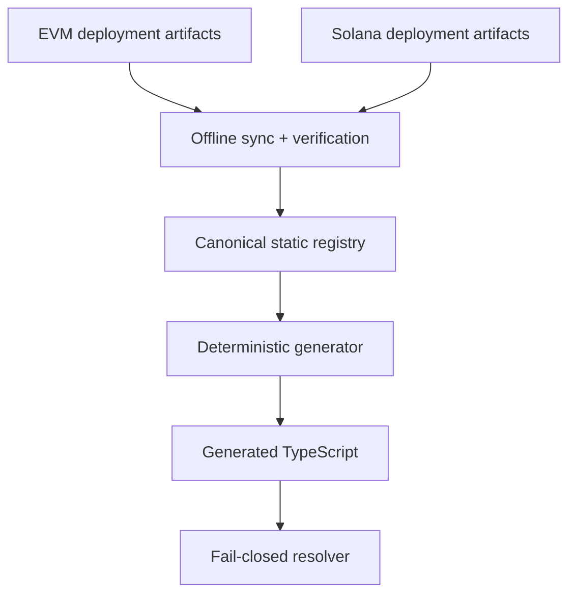

# AIFINP-223/224 — Canonical payment deployment registry

**Status:** proposed
**Date:** 2026-09-13
**Tickets:** AIFINP-223 (EVM), AIFINP-224 (Solana)
**Risk:** high — payment routing; AI autonomy cap 10–30%
**Decision:** one static registry, generated SDK artifacts, exact fail-closed
resolution, no runtime GitHub fetch, and no silent protocol-version fallback.

## 1. Scope

This design replaces the SDK's independent EVM and Solana deployment tables
with one reviewed, versioned registry. It covers:

- EVM v1.4 artifacts from `AiFinPay/evm-contract` commit
  `78240eccf96dd078c9b40be068d635b14876364c`;
- Solana v1.4 artifacts from `AiFinPay/solana-contract` commit
  `e5df8f5436cf646ab495381eee04e0d1a10b4e2f`;
- retained legacy EVM deployments while they remain explicitly supported;
- environment, network, version and asset selection;
- provenance, deployment readiness, and safe disablement.

The registry records where a deployment exists. It does not declare a payment
route usable merely because an address or program ID was published.

## 2. Current architecture and failure modes

The SDK currently has three payment-routing sources:

| Source | Purpose | Problem |
|---|---|---|
| `node/src/v14Deployments.generated.ts` | EVM v1.4 | Contains only Amoy and Polygon and pins obsolete source commit `67b3f518...`. |
| `node/src/solanaV14Deployments.generated.ts` | Solana v1.4 | Contains the superseded devnet/mainnet program IDs from `8a13d10...`. |
| `SPLITTER_DEPLOYMENTS` / `splitterRoutes.generated.ts` | legacy EVM | Separate model and selection path; includes BOT Chain. |

`node/src/deploymentResolver.ts` implements `auto` as “v1.4, otherwise v1.2”.
That is a change in payment semantics without payer consent. A missing or
disabled v1.4 record can therefore route money through a legacy contract.

Other observed mismatches:

- BOT Chain remains selectable in SDK modules even though contract ADR-0001
  forbids production settlement there.
- Robinhood (chain ID 4663) is absent from SDK payment-network definitions.
- the Polygon artifact labels `0x2791...` as USDT; this address must not be
  exposed as USDT until the asset identity is corrected and reverified;
- the Base artifact assigns the same address to `splitter` and `tokenList`.
  Those are different contract interfaces, so the artifact is not eligible for
  payment resolution;
- the current fixed `usdc` / `usdt` fields cannot represent Robinhood's USDe
  and USDG configuration;
- a contract deployment record does not prove that the backend can issue and
  verify receipts for that rail.

## 3. Target topology



There is no production-time request to GitHub, Jira, or a contract repository.
Updating an address requires a reviewed registry change and a new SDK package.

## 4. Canonical files

| File | Responsibility |
|---|---|
| `node/registry/payment-deployments.json` | Human-reviewable canonical registry for all rails and selectable protocol versions. |
| `node/registry/payment-deployments.schema.json` | Structural validation and enabled-record invariants. |
| `node/scripts/sync-payment-deployments.mjs` | Offline import from pinned local checkouts; never fetches at SDK runtime. |
| `node/scripts/check-payment-registry.mjs` | Provenance, uniqueness, address, state and generated-file drift checks. |
| `node/src/paymentDeployments.generated.ts` | Deterministic typed artifact; never edited by hand. |
| `node/src/deploymentResolver.ts` | EVM compatibility API backed only by the generated registry. |
| `node/src/solanaDeploymentResolver.ts` | Solana compatibility API backed only by the generated registry. |

The legacy generated files may remain as deprecated views for one release, but
they must be produced from `payment-deployments.json`. They cannot remain
independent sources of truth.

## 5. Registry schema

The top-level format is intentionally small:

```json
{
  "schemaVersion": 1,
  "sources": {
    "evm": {
      "repo": "AiFinPay/evm-contract",
      "commit": "78240eccf96dd078c9b40be068d635b14876364c"
    },
    "solana": {
      "repo": "AiFinPay/solana-contract",
      "commit": "e5df8f5436cf646ab495381eee04e0d1a10b4e2f"
    }
  },
  "networkDefaults": {},
  "deployments": []
}
```

Each deployment is a discriminated record:

| Field | Required meaning |
|---|---|
| `id` | Stable unique key: `<rail>:<environment>:<network>:<version>`. |
| `rail` | `evm` or `solana`. |
| `environment` | `dev` or `prod`; never inferred from a branch name. |
| `network` | Canonical SDK network name. |
| `aliases` | Closed reviewed list, for example `mainnet-beta` → `mainnet`. |
| `version` | Exact protocol version implemented by the target. |
| `state` | `enabled`, `disabled`, or `retired`. |
| `disabledReason` | Required unless `state` is `enabled`. |
| `provenance` | Source repo, commit, artifact path and SHA-256. |
| `verification` | Chain identity, timestamp, verifier version and hashes observed before enablement. |
| `assets` | Array of explicitly identified assets; no fixed USDC/USDT slots. |
| `evm` / `solana` | Rail-specific deployment payload. Exactly one is present. |

`networkDefaults` maps an exact `rail + environment + network` to one default
version. It is a selection value, not a fallback list.

### 5.1 EVM payload

An EVM entry contains:

- numeric `chainId`;
- splitter, TokenList and Profiles addresses;
- expected runtime code hash for each contract;
- signer, pauser, treasury and admin addresses;
- Safe address, owners and threshold when applicable;
- route profiles verified at the registry verification time.

An enabled EVM record must have three distinct contract addresses, non-empty
runtime code, matching runtime hashes, expected roles, an allowed asset set,
and a backend verifier approved for that exact chain and version.

### 5.2 Solana payload

A Solana entry contains:

- cluster and cluster genesis hash;
- program ID and executable program-data hash;
- program-data address and upgrade authority;
- IDL artifact path, version and SHA-256;
- initialized config PDA and the verified route/token state.

An enabled Solana record must prove that the program is executable and
initialized and that the backend can verify its settlement transaction. A
successful deploy signature alone is insufficient.

### 5.3 Assets

Every asset uses an array element rather than a symbol-named property:

```json
{
  "assetId": "circle:usdc",
  "symbol": "USDC",
  "kind": "erc20",
  "identifier": "0x...",
  "decimals": 6,
  "settlementEnabled": true,
  "provenance": "issuer registry or reviewed chain evidence"
}
```

`assetId` is the trusted identity. `symbol` is display metadata and cannot be
used to select a token. Native assets and Solana SPL mints use the same model
with `kind: native` or `kind: spl`.

## 6. Resolution rules

Payment selection takes the tuple:

`rail + environment + network + requestedVersion + requestedAsset`

Resolution is deterministic:

1. Normalize only documented aliases.
2. If the caller requests a version, find that exact record.
3. If the version is omitted or `auto`, read the single exact version from
   `networkDefaults`.
4. Never search another protocol version, environment, network, or rail.
5. Reject records whose state is not `enabled`.
6. If an asset is requested, require its exact `assetId` and identifier to be
   enabled for the selected deployment.
7. Return an immutable deployment object or a typed error.

Required errors:

- `UnknownNetworkError`
- `EnvironmentMismatchError`
- `VersionUnavailableError`
- `DeploymentDisabledError` with the registry reason
- `AssetUnavailableError`
- `RegistryInvariantError` for an impossible generated state

`auto` is retained only for API compatibility. It means “use the reviewed
default for this exact network”, not “try versions until one works”.

## 7. Network-specific decisions

| Network | Import state | Required handling |
|---|---|---|
| Amoy | disabled until verification refresh | Development only. Never resolve under `prod`. |
| Polygon | disabled during asset correction | Keep native USDC only after verification. Remove `0x2791...` from the USDT identity; do not silently rename a payment asset. |
| Base | disabled | Reject the current internally inconsistent deployment artifact. Re-enable only after a distinct verified splitter deployment and new artifact. |
| Arbitrum, Avalanche, BNB, Optimism, Unichain, XRPL EVM | imported disabled | Addresses may be shipped as metadata, but payment resolution remains off until contract-state, asset and backend-verifier gates pass. |
| Robinhood | imported disabled | Add chain ID 4663. Represent USDe and USDG through `assets[]`. Current zero USDC/USDT slots do not authorize stable settlement. |
| BOT Chain | excluded from payment defaults | Preserve a non-payment chain descriptor only if another SDK feature needs it. Resolver always throws `DeploymentDisabledError`; no production payment advertisement. |
| Solana devnet | disabled until full evidence | Use program ID `8dty5bD738Z9TzEkDu8vLSnhpJNWtEGMUEcYaKCUTY6y`; require executable hash, initialized state and IDL hash before enablement. |
| Solana mainnet | disabled until full evidence | Use program ID `724Ut31i4ecY4dJ25z8HuZetu3A43xtNkPdk4JdbsfdD`; require the same evidence plus backend settlement verification. |

The `disabled` state prevents a repeated production failure mode: publishing a
contract address before the complete quote → settlement → receipt path works.

## 8. Trust boundaries

| Boundary | Threat | Control |
|---|---|---|
| Contract repo → SDK registry | Stale, malformed or forged artifact | Pinned commit and artifact SHA-256; offline import; human-reviewed diff. |
| RPC → verifier | Wrong chain or compromised provider | Verify chain identity and use provider quorum before enablement. |
| Registry → generated TS | Hand-edited payout target | Deterministic generation and byte-for-byte CI drift check. |
| SDK input → resolver | Alias, environment or version confusion | Closed aliases, exact tuple, typed fail-closed errors. |
| SDK → wallet/RPC | Correct address but changed bytecode/state | Preflight chain ID and code/program hash before first payment session; abort on mismatch. |
| Backend → SDK | Quote for an unsupported deployment | Bind quote to chain/program, contract, version, route, asset and amount; require exact registry match. |
| Package publication → consumer | Registry artifact substituted | npm provenance/package integrity, release tag, source commits in generated metadata. |

Custom payment addresses are outside the safe resolver. If retained for local
development, they require an explicitly named unsafe API and are prohibited in
`prod` by default.

## 9. Impacted modules

### Direct

- `node/src/deploymentResolver.ts`
- `node/src/solanaDeploymentResolver.ts`
- `node/src/v14Deployments.generated.ts`
- `node/src/solanaV14Deployments.generated.ts`
- `node/src/unifiedAgent.ts`
- `node/src/splitterRoutes.ts` and `splitterRoutes.generated.ts`
- `node/src/chains.ts`
- `node/src/settlement.ts`
- `node/src/index.ts`
- `node/scripts/generate-splitter-routes.mjs`
- `node/scripts/check-registry-provenance.mjs`
- `mcp/src/tools/production-control.ts`

### Tests and release surfaces

- `node/tests/deploymentResolver.test.ts`
- `node/tests/solanaDeploymentResolver.test.ts`
- splitter deployment/route/settlement regression tests
- MCP network allow-list tests
- package exports, README and changelog
- CI registry drift and provenance jobs

The backend is a cross-repository dependency. A deployment cannot become
`enabled` until the matching backend quote and receipt verifier is available.

## 10. Compatibility and migration

1. Add the canonical JSON, schema, generator and tests with every imported
   record disabled.
2. Generate a single TypeScript deployment table.
3. Keep `resolveDeployment` and `resolveSolanaDeployment` signatures. Adapt
   their results from the new table so existing callers keep their shapes.
4. Retain `V14_DEPLOYMENTS`, `SOLANA_V14_DEPLOYMENTS` and source metadata as
   deprecated generated views for one release cycle.
5. Change `auto` to exact default selection. Emit a development warning for
   callers relying on `auto`; never emit a warning instead of blocking a
   payment.
6. Legacy v1.2/v1.3 is reachable only by an explicit version and only while its
   registry record is enabled. No new caller should default to it.
7. BOT Chain payment requests fail with a typed disabled error. Removing it
   from all public TypeScript unions can wait for the next breaking release if
   non-payment consumers still compile against the name.
8. Enable one deployment at a time after contract verification, backend
   support, funded end-to-end testing, security review and human approval.

Because the current SDK line is a release candidate, the resolver semantic
change should ship in the next RC. If published in a stable line, treat the
change as security-significant and document the behavior change prominently;
do not preserve unsafe fallback for semantic-version convenience.

## 11. Required validation

### Registry and generator

- schema validation and unique deployment IDs;
- exact network/chain/cluster identity;
- artifact hash and pinned commit verification;
- deterministic generation with a clean-tree drift check;
- enabled-record invariants;
- rejection of zero addresses, duplicate contract addresses and unknown asset
  identities.

### Resolver

- no v1.4 → v1.2 fallback;
- no dev → prod or prod → dev crossover;
- missing/disabled Base fails closed;
- BOT Chain always fails closed for payment;
- Robinhood cannot select zero USDC/USDT;
- Polygon cannot resolve `0x2791...` as USDT;
- Solana aliases resolve only to the exact cluster;
- corrupt generated data raises `RegistryInvariantError` before wallet/RPC use.

### Integration

- exact quote/contract/program/asset binding;
- one funded end-to-end test per enabled deployment;
- receipt verification and replay/idempotency checks;
- first-payment preflight rejects code or program hash drift.

## 12. Rollout and rollback

Rollout is registry-first and network-by-network. Disabled metadata can ship
without making a route payable. Enabling a route requires a reviewed registry
diff and a new SDK/backend release.

Rollback never changes protocol version automatically. Publish a new registry
with the affected record `disabled`, pause the contract where appropriate, and
release the SDK/backend change. A caller receives `DeploymentDisabledError` and
does not submit funds.

## 13. Architecture gate

- [x] Existing resolver, generated tables, registries and upstream deployment
  artifacts analyzed.
- [x] Impacted SDK modules and cross-repository backend dependency identified.
- [x] Data generation, runtime selection and trust dependencies documented.
- [x] ADR created for the non-trivial fail-closed decision.
- [ ] Repository bootstrap requirement satisfied: root `AGENTS.md` and
  `ARCHITECTURE.md` are absent.
- [ ] CTO/human reviewer approves the detailed schema and migration plan.

**Gate result: BLOCKED.** The architecture is ready for review, but the SDLC
Architecture Gate cannot hand off to implementation until the two repository
bootstrap files exist and a human engineering owner approves this payment-risk
design.
