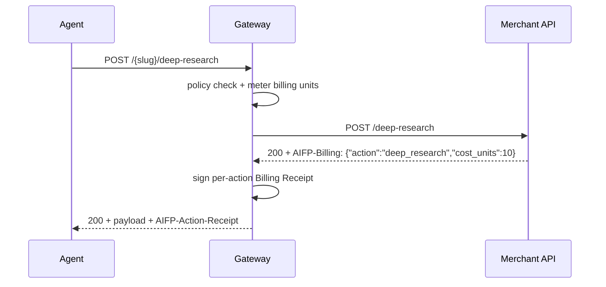

# gateway-merchant — emitting `AIFP-Billing` behind the hosted gateway

The smallest possible merchant API that runs **behind the AiFinPay hosted
gateway** (`gateway.aifinpay.io/{your-slug}/…`). The gateway handles agent
identity, metering, and payment; after your API answers, the gateway signs a
**per-action Billing Receipt** for the agent from the metadata you emit.

Your entire integration surface is one response header:

```
AIFP-Billing: {"action":"deep_research","cost_units":10,"category":"premium","execution_time_ms":840,"status":"ok"}
```

- `action` (required) — human action name, e.g. `search`, `deep_research`.
- `cost_units` (optional, informational) — the gateway's own action-registry
  weight is the billing authority; this is a hint/confirmation.
- `category`, `execution_time_ms`, `bytes`, `tokens`, `status` — optional
  telemetry, surfaced on the signed receipt and the merchant dashboard.
- Single-line JSON, no newlines. If the header is absent, the gateway falls
  back to the registry weight for the matched route — so metadata is optional
  for simple merchants and useful for per-action pricing/analytics.



## Run it

```bash
npm install && node server.js
# → [gateway-merchant] example API on port 3002

curl -si -X POST localhost:3002/search \
  -H 'content-type: application/json' -d '{"query":"agent economy"}' \
  | grep -i aifp-billing
# → AIFP-Billing: {"action":"search","cost_units":1,"execution_time_ms":0,"status":"ok"}
```

## Two named actions

| Route | Action | Units |
|---|---|---|
| `POST /search` | `search` | 1 |
| `POST /deep-research` | `deep_research` | 10 |

## The two SDK patterns

**Per-handler** (used in `server.js`) — `withBilling()` attaches
`res.setAifpBilling(meta)`; call it before `res.json(...)`:

```js
import { withBilling } from "@aifinpay/agent";

app.use(withBilling());
app.post("/deep-research", (req, res) => {
  res.setAifpBilling({ action: "deep_research", cost_units: 10 });
  res.json(report);
});
```

**Centralized** — pass a `classify(req, res)` function; the header is
injected just before the response is sent (an explicit `setAifpBilling`
call in a handler always wins):

```js
app.use(withBilling((req) => ({
  action: req.path === "/deep-research" ? "deep_research" : "search",
  cost_units: req.path === "/deep-research" ? 10 : 1,
})));
```

No Express? Build the header value directly:

```js
import { billingHeader } from "@aifinpay/agent";
myResponse.headers["AIFP-Billing"] = billingHeader({ action: "search", cost_units: 1 });
```

Python (FastAPI/Flask) mirror: `from aifinpay import billing_header` — see
the [`aifinpay-agent` README](../../python/README.md).

## License

MIT.
