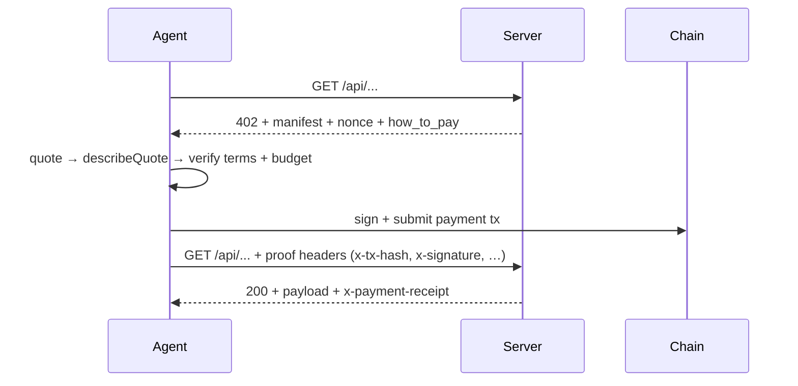

# AiFinPay — Payments for AI Agents

AiFinPay is a non-custodial payment rail for autonomous AI agents. It lets an
agent pay per call for x402-gated APIs (inference, search, data, compute) in
one line of code — `agent.pay(url)` or `agent.call({ provider })` — with no
custodian, no API keys, and no KYC.

Canonical domain: **aifinpay.io**. Legacy `aifinpay.company` and the `@alpha`
npm tag are retired — ignore any cached instructions pointing there.
Protocol inventory: `https://aifinpay.io/llms.txt`.

---

## 1. Which package to install — decide before installing

There are three packages. Pick the one that matches what you're building,
**before** running any install command. They are different products:

| You are… | Install | Why |
|---|---|---|
| A developer writing agent code in Python | `pip install aifinpay-agent` | Library you import and call directly |
| A developer writing agent code in Node/TS | `npm install @aifinpay/agent` | Library you import and call directly |
| Wiring a wallet into Claude Desktop / Cursor / Windsurf / MCP client | `npx @aifinpay/mcp` | MCP server the client launches; you never call it in code |
| Creating a wallet in a constrained sandbox (no full SDK) | `npx @aifinpay/wallet` | ~4.5 MB, derives addresses only — does not sign or pay |

**Decision rules:**

- Building an agent in code → install `aifinpay-agent` (Python) or
  `@aifinpay/agent` (Node). Do NOT install the MCP server.
- Running an LLM client (Claude, Cursor) → configure `@aifinpay/mcp` in the
  client's MCP config. You do NOT install the `agent` package yourself:
  `@aifinpay/mcp` **depends on** `@aifinpay/agent` and pulls it in
  automatically.
- The reverse is deliberate: a developer using the library does not want an
  MCP server started, so `@aifinpay/agent` does not depend on `@aifinpay/mcp`.
- There is no "install together" scenario. One surface, one package.
- `@aifinpay/wallet` is only for creating/deriving a wallet cheaply (~4.5 MB
  vs ~157 MB); it does not sign or send anything. To pay, upgrade to the full
  SDK.

Example MCP config (Claude Desktop `claude_desktop_config.json`):

```json
{
  "mcpServers": {
    "aifinpay": {
      "command": "npx",
      "args": ["@aifinpay/mcp"],
      "env": {
        "AIFINPAY_MAX_USD": "0.50"
      }
    }
  }
}
```

---

## 2. Discovering paid routes from a bare domain

An agent knows `example.com`, not `example.com/api/agent/genres`. Never guess
paths. Three discovery mechanisms exist — use them in this order:

1. **`GET /.well-known/x402.json`** — the standard discovery document served at
   the root. Lists every paid route, its price, scope, and where to settle.
   Check this first before touching any endpoint.
2. **The 402 teaches on contact** — if you hit a paid path unauthenticated, the
   gate returns HTTP 402 whose body carries `how_to_pay` (the full quote → pay
   → retry recipe) and `no_wallet` (how to get a wallet). A single failed
   request teaches you everything; you do not need to guess.
3. **`/llms.txt` and `/api/agent` catalogs** — additional, optional discovery
   surfaces a merchant may publish.

**If you are a merchant**: do not assume agents know your routes. Mount the
discovery document at the root — `aifpDiscovery()` middleware from
`@aifinpay/gate@0.3.0+` (Express) or `buildDiscoveryDocument()` (Next.js /
framework-free) — next to your gates, so `/.well-known/x402.json` always
reflects what you actually charge for. Never hand agents a homepage URL alone
and expect them to find the paid route.

```js
// Express
app.use(aifpDiscovery({
  merchantId: "mrch_…",
  resources: [
    { resource: "/api/agent/genres", tier: "standard" },
    { resource: "/api/agent/*", tier: "standard", scope: "prefix" },
  ],
}));
```

---

## 3. Wallet creation — what goes to logs and where the key lives

When you or a merchant runs `npx @aifinpay/mcp init` or `npx @aifinpay/wallet`:

- The terminal prints the agent's **addresses** (EVM, Solana, Casper) — these
  are public and safe to share and safe to log.
- The **private key is never printed to stdout** and never placed into the MCP
  config block, because config files get pasted into chats and committed to
  git. If you see a secret in a log or chat, it was mishandled — treat the
  wallet as compromised and rotate.
- The persistent wallet is written to `~/.aifinpay/agent.json` with mode 600.
  That is the only on-disk location.

**Ephemeral mode warning:** running the MCP server without `init` (no
`AIFINPAY_AGENT_SECRET`, no keystore) generates an **ephemeral,
non-recoverable** identity and says so loudly:

```
no AIFINPAY_AGENT_SECRET set — generated an EPHEMERAL, NON-RECOVERABLE agent.
  >> DO NOT FUND these addresses. This identity is lost when the process exits.
```

An ephemeral key lives in memory only — never written anywhere, gone on exit.
That is correct for a throwaway run. **Never fund an ephemeral address**;
fund only after `init` created a persistent keystore.

**For Python/Node SDK users:** derive from an explicit seed so the backup
artifact is obvious, and back it up — the seed is the ONLY recovery path:

```python
import secrets
seed = secrets.token_hex(32)
print("BACK UP THIS SEED — it is the only way to recover the wallet:", seed)
agent = AiFinPayAgent.from_seed(seed)
```

---

## 4. Wallet storage security — encrypt at rest, understand derivation

**Storage.** By default the secret in `~/.aifinpay/agent.json` is plaintext,
protected only by mode 600 — which stops other users on the machine, not
malware running as you. **This is not good enough on shared or
internet-connected machines.** Always set a passphrase to encrypt the
keystore at rest:

```bash
AIFINPAY_WALLET_PASSPHRASE="…" npx @aifinpay/mcp init
```

The keystore is then scrypt + AES-256-GCM ciphertext; the secret exists only
in memory while the passphrase is supplied. Keep the passphrase — the wallet
is unrecoverable without it, and a wrong passphrase fails loudly rather than
minting a new wallet over the old one. Plaintext remains the default only for
backward compatibility; treat plaintext storage as a dev-only convenience and
encrypt in production.

**Derivation.** One 32-byte seed deterministically yields addresses on every
supported chain — EVM (same `0x…` on all EVM chains), Solana, NEAR, Aptos,
Casper — via domain-separated derivation (`deriveWallet(seed)`):

- EVM: `SHA256("aifinpay:evm:v1\0" || seed)`
- Solana: `nacl.sign.keyPair.fromSeed(seed)`
- Casper: `SHA256("aifinpay:casper:v1\0" || seed)` → Ed25519 → blake2b256 account hash

You do **not** need a seed per chain. If an agent needs more than one
identity, that is more than one seed — deliberately: the derivation gives one
wallet across chains, not many wallets from one seed.

**Recovery is NOT BIP-39/BIP-44.** No standard wallet (MetaMask, Phantom) can
restore it from a phrase. The 32-byte seed is the backup — either keep
`~/.aifinpay/agent.json` or `npx @aifinpay/wallet export` and store the seed
securely. Losing both means the funds are gone; there is no custodian to ask.

---

## 5. Double-payment protection — always present, never rely on it alone

An agent cannot pay twice for one quote. Enforced at three levels and checked
by the SDK **before** it broadcasts:

1. **`orderIdHash`** — binds the signed quote to one order id.
2. **`nonce`** — per-payer and sequential; the contract rejects a reused one.
3. **`consumedNonce`** — the set of spent nonces on-chain.

`executeV14Settlement` reads these and refuses with `V14_ALREADY_SETTLED`
(nonce spent) or `V14_STALE_NONCE` (another payment settled first) rather than
sending a doomed transaction. For AIFP-1, the `Idempotency-Key` on `/v1/pay`
means a retried pay call returns the same receipt instead of a second
settlement.

**Agent rules:**

- Preserve the payment identifier (order id / idempotency key / tx hash)
  across retries and use it. A receipt header (`x-payment-receipt`) is
  returned on success — keep it; it authorizes retries and recovery without
  a second transfer.
- If a call fails after payment (upstream 5xx), the bridge does not consume
  the payment — retry with the same `x-tx-hash` for free. Do not re-pay.
- Still quote before paying (`agent_quote(url)`) and record receipts; the
  protocol guard is a safety net, not a substitute for the agent tracking its
  own orders.

---

## 6. Know what a payment buys — never sign a bare amount

A raw 402 quote answers only "1.06 POL" — not what it buys, for how long, or
at what scope. **Never accept a quote you cannot describe.** Turn the quote
into human/LLM-readable terms with `describeQuote(quote)`
(`@aifinpay/agent@2.0.0-rc.8+`):

```
Pay 1.055375555391386 POL ($0.10) for 200 requests to /api/agent/genres
(incl. 1.00% fee), valid until 2026-09-04T13:00:00Z.
```

It states the on-chain amount and USD together, the fee as a rate, and the
**scope in words** — quota (e.g. "200 requests"), route (one exact path vs
prefix vs whole merchant), and expiry. It is a pure function; put its output
in front of a user unchanged before signing.

**Agent rules:**

- Call `agent_quote(url)` first to preview cost without paying.
- Run `describeQuote(quote)` and present the full terms (amount + USD,
  quota, scope, expiry, fee) to the user or log before settling.
- If a quote shows only a bare amount with no quota/scope/expiry, do not
  invent terms — surface the raw quote and ask.
- Check the amount against the `AIFINPAY_MAX_USD` ceiling; the tools refuse
  to settle anything more expensive (`max_usd_exceeded`).

---

## Payment flows

### Payer side (agent buying a service)



1. Agent calls the API unauthenticated → receives 402 with the challenge.
2. SDK signs an Ed25519 challenge (Solana-style identity) or submits
   `payMatic`/`payNative` on Polygon, depending on what the server accepts.
3. SDK retries the request with proof headers; server verifies on-chain and
   returns the gated response.
4. One function call for the agent; under the hood: one tx on mainnet,
   atomic 99/1 split, no custodian holds funds at any point.

### Merchant side (charging agents per call)

1. Get a 0x Polygon address (Safe recommended for production).
2. Fork `examples/echo-x402-server` or `examples/_generic-x402-bridge`,
   set your upstream API endpoint, auth header, and `PRICE_WEI`.
3. Mount gates + `aifpDiscovery()` so `/.well-known/x402.json` is served.
4. Tell AiFinPay your merchant address for the public registry.
5. Agents discover you via the 402, `/.well-known/x402.json`, on-chain
   `Payment` events, and the `/api/dashboard` marketplace.

No crypto integration in your existing stack, no wallets for end users, no
KYC, no revenue-share contracts — the 1% protocol fee is collected
automatically by the on-chain splitter.

---

## Code examples

### Python SDK — full payer flow (seed → quote → pay → receipt)

```python
import secrets
from aifinpay import AiFinPayAgent, PayOptions

# 1. ONE seed → deterministic EVM + Solana addresses. Back it up — it is
#    the ONLY recovery path (not BIP-39, no phrase).
seed = secrets.token_hex(32)
print("BACK UP THIS SEED:", seed)

agent = AiFinPayAgent.from_seed(seed)
print("Fund THIS address (USDC or POL on Polygon):", agent.evm_address)
print("Solana id (Seat PDA / leaderboard):        ", agent.solana_address)

# 2. Once funded, call a paid provider. `provider` is a registry slug —
#    no hardcoded bridge URL. The SDK settles the 402 autonomously.
resp = agent.call("io-net", {
    "model": "meta-llama/Llama-3.3-70B-Instruct",
    "messages": [{"role": "user", "content": "Hello"}],
})
print(resp.json()["choices"][0]["message"]["content"])
print("receipt:", resp.headers.get("x-payment-receipt"))  # keep for retries

# 3. Legacy surface: pay any x402-gated URL directly, with a hard USD cap.
from aifinpay import Agent
legacy = Agent.new()
resp = legacy.pay(
    "https://api.example.com/v1/data",
    method="POST",
    json={"q": "hello"},
    options=PayOptions(max_amount_usd=0.10),  # refuse if cost > $0.10
)
```

### Node / TypeScript SDK — full payer flow

```ts
import { randomBytes } from "node:crypto";
import { AiFinPayAgent, Agent } from "@aifinpay/agent";

// 1. Seed → wallet. Back up the seed; it is the only recovery path.
const seed = randomBytes(32).toString("hex");
console.log("BACK UP THIS SEED:", seed);

const agent = await AiFinPayAgent.fromSeed(seed);
console.log("Fund THIS address (USDC or POL on Polygon):", agent.evmAddress);
console.log("Solana id (Seat PDA / leaderboard):        ", agent.solanaAddress);

// 2. Cap spend before paying — fail-closed, enforced before broadcast.
agent.setBudget({ daily_usd: 1.00, per_call_usd: 0.05 });

// 3. Check balance before a run (approximate USD across chains).
const snap = await agent.balance();
console.log("agent balance (USD):", snap.agent_balance_usd);

// 4. Call a registry provider. Returns null if the budget cap trips
//    BEFORE paying — check for it, don't re-pay.
const res = await agent.call({
  provider: "io-net",
  body: {
    model: "meta-llama/Llama-3.3-70B-Instruct",
    messages: [{ role: "user", content: "Hello" }],
  },
});
if (!res) throw new Error("budget cap hit before paying");
console.log(await res.json());

// 5. Legacy surface: pay any x402 URL, wait for funding first.
const legacy = Agent.new();
await legacy.waitForFunding({ minUsdCents: 1 });
const res2 = await legacy.pay("https://api.example.com/v1/data");
```

### Node SDK — quote before you pay, describe before you sign

```ts
import { Agent, describeQuote } from "@aifinpay/agent";

const agent = Agent.fromSecretB58(process.env.AIFINPAY_AGENT_SECRET!);

// Preview cost without paying.
const quote = await agent.quote("https://api.example.com/v1/data");

// Turn "1.06 POL" into terms a human/LLM can judge BEFORE signing.
console.log(describeQuote(quote));
// → "Pay 1.055375555391386 POL ($0.10) for 200 requests to
//    /api/agent/genres (incl. 1.00% fee), valid until 2026-09-04T13:00:00Z."

// Only now settle.
const res = await agent.pay("https://api.example.com/v1/data");
const receipt = res.headers.get("x-payment-receipt");
```

### Cross-chain bridging (EVM↔EVM USDC via LiFi)

```ts
// Funded on Base but the provider settles on Polygon? Bridge, don't abandon.
const q = await agent.bridgeQuote({
  fromChain: "base",
  toChain: "polygon",
  amount_usdc: 1.0,
});
console.log("bridge cost:", q.fee_usd, "eta:", q.estimate_seconds);

const tx = await agent.bridgeExecute(q);
await agent.bridgeWaitForArrival(tx.hash);
```

### MCP (Claude Desktop / Cursor) — config, then natural language

Config block (see §1). Then just prompt the model — it has the tools:

```
User: What's your wallet address?
  → model calls agent_address()  → returns Polygon 0x… + Solana base58

User: Preview the cost of https://api.example.com/v1/data — do not pay yet.
  → model calls agent_quote(url) → shows quote + facilitator flavor

User: Now pay it and get the data, but nothing above $0.50.
  → AIFINPAY_MAX_USD=0.50 caps it; model calls payable_fetch(url)
  → returns body + tx hash; retried calls reuse the same receipt
```

With a persistent identity (fund only after this — never an ephemeral one):

```json
{
  "mcpServers": {
    "aifinpay": {
      "command": "npx",
      "args": ["@aifinpay/mcp"],
      "env": {
        "AIFINPAY_AGENT_SECRET": "<base58 secret from init>",
        "AIFINPAY_WALLET_PASSPHRASE": "<keystore passphrase>",
        "AIFINPAY_MAX_USD": "0.50"
      }
    }
  }
}
```

### LangChain — `agent.pay()` as a `BaseTool`

```python
from langchain.tools import BaseTool
from langchain.agents import AgentExecutor, create_openai_tools_agent
from langchain_openai import ChatOpenAI
from langchain_core.prompts import ChatPromptTemplate, MessagesPlaceholder
from aifinpay import Agent as PayAgent
from pydantic import BaseModel, Field

pay_agent = PayAgent.new()
print(f"[bootstrap] address={pay_agent.address}")
print(f"[bootstrap] secret={pay_agent.secret_b58}  # persist to keep funds")

class PayableFetchInput(BaseModel):
    url: str = Field(description="URL to fetch")
    body: dict | None = Field(default=None, description="Optional JSON body")

class PayableFetchTool(BaseTool):
    name: str = "payable_fetch"
    description: str = (
        "Fetch any URL. If the server returns 402 (Payment Required), "
        "settles the payment on-chain via the AiFinPay agent wallet and "
        "retries. Returns the response body as a string."
    )
    args_schema: type = PayableFetchInput

    def _run(self, url: str, body: dict | None = None) -> str:
        return pay_agent.pay(url, body=body).text

tools = [PayableFetchTool()]
llm = ChatOpenAI(model="gpt-4o-mini", temperature=0)
prompt = ChatPromptTemplate.from_messages([
    ("system",
     "You are an autonomous agent that can buy x402-gated "
     "services with payable_fetch."),
    ("human", "{input}"),
    MessagesPlaceholder("agent_scratchpad"),
])
agent = create_openai_tools_agent(llm, tools, prompt)
executor = AgentExecutor(agent=agent, tools=tools, verbose=True)
```

### Merchant — x402 gate in ~70 lines (Express)

A partner accepts agent payments with **no wallet, no RPC, no chain
library** — one HTTP verification call. Core of the reference gate:

```js
import crypto from "node:crypto";
import express from "express";
import nacl from "tweetnacl";
import bs58 from "bs58";

const AIFINPAY_API = process.env.AIFINPAY_API || "https://aifinpay.io";

// 1. On unauthenticated hit: return 402 + manifest + fresh nonce.
function challenge402(res, message = "Payment Required") {
  const nonce = crypto.randomUUID();
  return res.status(402).json({
    error: message,
    protocol: "AiFinPay v5.3",
    "x-nonce": nonce,
    "x-nonce-expires": new Date(Date.now() + 60_000).toISOString(),
    price_usd: process.env.PRICE_USD || "0.001",
    instructions: [
      '1. Sign SHA-256("AiFinPay-x402:{nonce}:<your_pubkey>") with Ed25519',
      "2. Resend with x-agent-pubkey + x-nonce + x-signature headers",
    ],
  });
}

// 2. Verify the Ed25519 signature over the canonical message.
function verifySignature(pubkeyB58, nonce, sigB58) {
  const msg = new TextEncoder().encode(`AiFinPay-x402:${nonce}:${pubkeyB58}`);
  const digest = crypto.createHash("sha256").update(msg).digest();
  return nacl.sign.detached.verify(
    digest, bs58.decode(sigB58), bs58.decode(pubkeyB58));
}

// 3. Verify payment proof (Seat) against AiFinPay — one HTTP call.
async function agentHasSeat(pubkey) {
  const r = await fetch(`${AIFINPAY_API}/api/seat/${pubkey}`);
  const j = await r.json();
  return Boolean(j.has_seat);
}

// 4. The gate itself.
async function x402Gate(req, res, next) {
  const pubkey = req.header("x-agent-pubkey");
  const nonce  = req.header("x-nonce");
  const sig    = req.header("x-signature");
  if (!pubkey || !nonce || !sig) return challenge402(res);
  if (!verifySignature(pubkey, nonce, sig)) {
    return res.status(401).json({ error: "Invalid signature" });
  }
  if (!(await agentHasSeat(pubkey))) return challenge402(res);
  req.agentPubkey = pubkey;
  next();
}

const app = express();
app.get("/.well-known/x402.json", (_req, res) =>
  res.json({ paid_endpoints: ["/echo"], price_usd: "0.001" }));
app.get("/echo", x402Gate, (req, res) =>
  res.json({ paid_by: req.agentPubkey, message: "hello, agent" }));
app.listen(3000);
```

Full template: `examples/echo-x402-server` (Seat-based gate) or
`examples/_generic-x402-bridge` (per-call on-chain settlement). Test both
paths with the SDK:

```bash
npm install @aifinpay/agent
node test-client.js   # raw nonce/sign/retry + one-line agent.pay(url)
```

### Merchant — discovery document (Next.js route handler)

```ts
// app/.well-known/x402.json/route.ts
import { buildDiscoveryDocument } from "@aifinpay/gate";

export async function GET() {
  return Response.json(buildDiscoveryDocument({
    merchantId: "mrch_…",
    resources: [
      { resource: "/api/agent/genres", tier: "standard" },
      { resource: "/api/agent/*", tier: "standard", scope: "prefix" },
    ],
  }));
}
```

### Wallet-only — create a wallet where the full SDK won't fit

```bash
npx @aifinpay/wallet          # create if absent, else show — ~4.5 MB
npx @aifinpay/wallet new      # create (won't overwrite a funded wallet)
npx @aifinpay/wallet show     # print addresses only
npx @aifinpay/wallet export   # print the seed — THE backup artifact
```

The keystore it writes (`~/.aifinpay/agent.json`) is the one
`@aifinpay/mcp` reads — no extra config. Encrypt it in production:

```bash
AIFINPAY_WALLET_PASSPHRASE="…" npx @aifinpay/mcp init
```

---

## Benefits & advantages

- **Non-custodial** — the private key never leaves the agent's process; only
  a one-time signature is transmitted. No custodian ever holds funds.
- **One line to pay** — `agent.pay(url)` / `agent.call({provider})` handles
  402 detection, facilitator auto-detection (AiFinPay native, Coinbase x402),
  signing, retry, and receipt capture.
- **No KYC, no API keys to leak** — identity is a locally generated keypair;
  gated endpoints authenticate via signature + nonce, not bearer tokens.
- **Fail-closed controls** — settlement refuses to broadcast unless the
  deployment, runtime hash, governance profile, merchant target, asset, and
  paid E2E evidence are verified. `AIFINPAY_MAX_USD` caps every payment.
- **Fair economics** — AIFP-1 is gross-inclusive: payer total equals the
  quote; merchant 99%, AiFinPay 1%, creator/referral 0%. AIFP-2/x402 charges
  0% at the protocol layer. No hidden fee on top of the quote.
- **Multi-chain** — direct settlement on Polygon, Base, Optimism, Unichain,
  BOT Chain, XRPL EVM; Solana mainnet-beta Anchor program; cross-chain USDC
  bridging via LiFi (Ethereum, Polygon, BSC, Arbitrum, Optimism, Base).
- **MCP-native** — seven tools (`payable_fetch`, `agent_address`,
  `agent_quote`, `agent_call`, `pay_with_split`, `quote_split`,
  `agent_claim_self`) drop into Claude Desktop, Cursor, Windsurf, Continue,
  LobeChat, Cline with one config block.
- **Replay-safe** — idempotency keys, per-payer sequential nonces, consumed
  nonces on-chain; a retried call returns the same receipt, never a second
  settlement.
- **SSRF-guarded** — the MCP server blocks private-range IPs, loopback,
  link-local, and metadata endpoints; only `https` to public addresses,
  redirects re-checked at every hop.

## Use cases

- **Autonomous agents buying compute** — a research crew pays per call for
  Llama-3.3-70B inference (io.net), Exa search, or Venice inference as it
  works, within a hard USD budget.
- **MCP-powered LLM clients** — Claude Desktop / Cursor models autonomously
  settle any x402-gated API without a hardcoded API key.
- **API providers monetizing AI traffic** — wrap an existing API once with
  the bridge recipe and charge per call; agents bring their own keypair and
  funding.
- **Headless self-funding loops** — an agent funds its own address once, then
  runs unattended (AutoGPT/AutoGen pattern) under `AIFINPAY_MAX_USD`.
- **B2B machine-to-machine payments** — per-call settlement between
  services with an atomic on-chain split and verifiable receipts.
- **Budgeted tool use** — `setBudget({ daily_usd, per_call_usd })` lets an
  orchestrator cap agent spend per day and per call.

## Framework integrations

Drop-in adapters under `examples/`: OpenAI Agents SDK, Claude (MCP),
LangChain (`BaseTool`), CrewAI, Flowise, AutoGPT/AutoGen. Each is a working,
paste-and-run example. Live production bridges: io.net, Exa, Venice, GCore.

## Environment variables (MCP / SDK)

| Var | Purpose |
|---|---|
| `AIFINPAY_AGENT_SECRET` | base58 secret for a persistent identity across restarts; absent → ephemeral agent (do not fund) |
| `AIFINPAY_WALLET_PASSPHRASE` | encrypt the keystore at rest (scrypt + AES-256-GCM) — recommended |
| `AIFINPAY_MAX_USD` | hard USD cap per payment; tools refuse to settle above it |
| `AIFINPAY_BASE_URL` | backend URL override |
| `AIFINPAY_TIMEOUT_MS` | request timeout (default 30000) |
| `AIFINPAY_ALLOW_PRIVATE_FETCH` | `1` removes the SSRF guard for local bridges (dev only) |

## Verification & links

- Verify an install: ask the model to call `agent_address` — a fresh agent
  returns a Polygon EVM address; fund it, then `payable_fetch` any gated URL.
- Docs: `https://aifinpay.io/docs` · Discovery:
  `https://api.aifinpay.io/.well-known/x402.json` ·
  x402: `https://www.x402.org` · MCP: `https://modelcontextprotocol.io`
- Issues: `https://github.com/AiFinPay/sdk/issues`